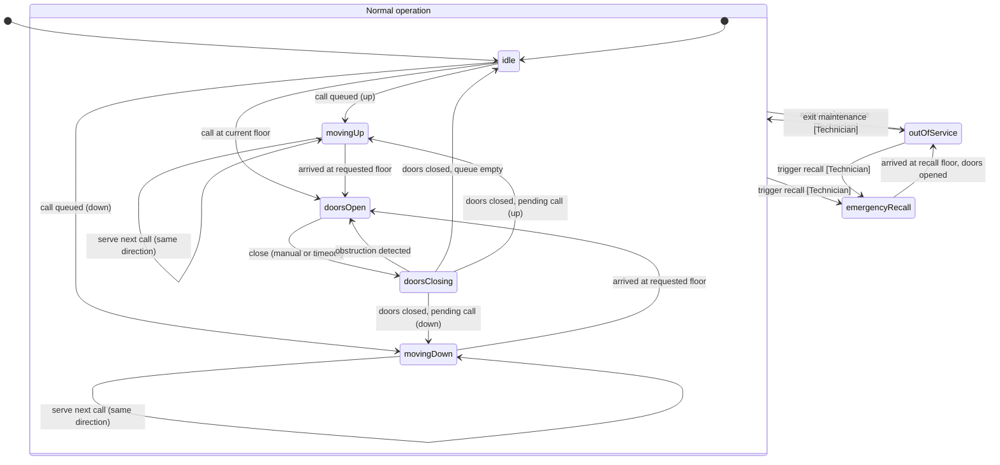

# Domain-driven web APIs

This repository is for the talk "Domain-driven web APIs" given by Asbjørn
Ulsberg at JavaZone 2026.

## Abstract

In a world where code is increasingly being generated by AI, the hard work
is no longer in writing the code, but in domain discovery, understanding
workflows, establishing service boundaries, and supporting personas.

Some may argue that this has always been the case, but it's now becoming
more apparent than ever. In order to fully acknowledge this shift, we need
to rethink how we design our web APIs. Instead of focusing on the technical
aspects of API design, we should focus on the business domain and the
behaviors that we want to expose through our APIs.

If you believe that the best, or perhaps even only way to design a web API
is around the four verbs of CRUD (Create, Read, Update, Delete), you are
not alone.

While CRUD-based APIs are straightforward and easy to implement, they often
fail to capture the true essence of the business domain they are meant to
serve. This dissonance between the API design and the business domain can
lead to challenges in maintaining and evolving the API as the business
requirements change.

This talk explores an alternative approach to designing web APIs that
focuses on the behavior in the business domain rather than just the data
operations. By leveraging domain-driven design principles, we can create
APIs that are more aligned with the business needs, easier to understand,
and more adaptable to change.

## Domain

The demo application models a single elevator (lift) control system. See
[`docs/architecture.md`][1] for the full domain description, personas, and
layered architecture.

### Elevator state machine



Notes:

- The **Rider** persona drives the "Normal operation" transitions (calls,
  car calls, door open/close); the **Technician** persona drives
  maintenance and emergency recall via a key-switch.
- Entering maintenance or triggering emergency recall pre-empts *any*
  normal-operation state and clears the pending request queue.
- Emergency recall always settles into `outOfService` once it reaches the
  recall floor and opens its doors; exiting maintenance is what returns the
  elevator to `idle`, whether it got to `outOfService` via maintenance or
  via a cleared emergency recall.

## Repository structure

This is a monorepo with three applications, described in full in
[`docs/architecture.md`][1]:

- `elevator-api/`: Java 21 + Spring Boot 4 (Gradle Kotlin DSL) -- the
  hypermedia API
- `elevator-ui/`: Nuxt.js 4 -- a front-end shell only (pages, layouts,
  CSS, the shaft animation); no backend-for-frontend (BFF). Every
  request, including the technician's, goes straight to `elevator-api`
- `elevator-auth/`: Spring Authorization Server; issues the
  technician's scoped tokens and nothing else

See [`AGENTS.md`][2] for coding conventions and more detailed run/test
instructions.

## Running locally

The easiest way to run the whole stack is via Docker Compose from the
repository root:

```sh
docker compose up
```

This starts `elevator-api`, `elevator-ui` and `elevator-auth` behind a
shared Caddy reverse proxy on `http://localhost:8000` -- the individual
services no longer publish their own ports (see
[`docs/architecture.md`][1]'s "Roadmap" -- slice 0). Visit
`http://localhost:8000` for the rider console; `elevator-api`'s own
endpoints are reachable at the same origin under `/elevators` and
`/rels`.

To run the applications directly, without Docker:

```sh
cd elevator-api
./gradlew bootRun
```

```sh
cd elevator-ui
npm install
npm run dev
```

Note that `elevator-ui` discovers its elevator by following links from
`elevator-api`'s own entry point (`GET /`, then the `elevators`
collection it names), and connects to that elevator's own event stream
the same way -- all via relative URLs, which only resolve correctly
behind the shared Caddy origin above. Running `npm run dev` standalone,
without Docker Compose in front of it, will show "Unable to reach the
elevator" until it is proxied the same way.

## Technician key

The elevator's key-switch actions -- enter/exit maintenance and emergency
recall -- are not tied to a login. They simulate physical key-switch
access, and are authorised with OAuth 2.0 access tokens carrying one of
two scopes: `elevator:maintenance` or `elevator:recall`.

`elevator-auth` issues the tokens; `elevator-api` both validates them by
signature against that issuer for every command, and -- the one place it
plays OAuth2 client rather than resource server -- exchanges what the
technician types for a token it keeps in an `HttpOnly` cookie. The
credential never reaches browser JavaScript, and neither does the token.

The dev credential is `dev-secret-key`, configured on `elevator-auth` via
`TECHNICIAN_CLIENT_SECRET`. It is the OAuth client secret for the
registered `elevator-technician` client -- a simplification, since client
secrets are not meant to be typed by humans, and one that
[`docs/architecture.md`][1] records as deliberate.

[1]: docs/architecture.md
[2]: AGENTS.md
