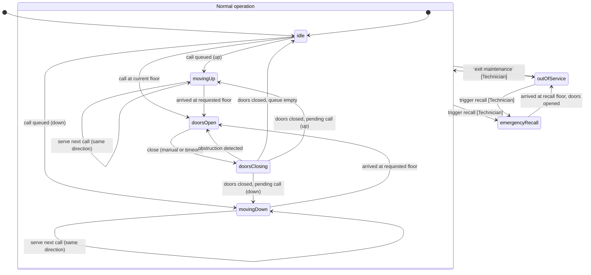

# Domain-driven web APIs

This repository is for the talk "Domain-driven web APIs" given by Asbjørn
Ulsberg at JavaZone 2026.

## Abstract

In a world where code is increasingly being generated by AI, the hard work
is no longer in writing the code, but in domain discovery, understanding
workflows, establishing service boundaries, and supporting personas.

Some may argue that this has always been the case, but it's now becoming
more apparent than ever. In order to fully acknowledge this shift, we need
to rethink how we design our web APIs. Instead of focusing on the technical
aspects of API design, we should focus on the business domain and the
behaviors that we want to expose through our APIs.

If you believe that the best, or perhaps even only way to design a web API
is around the four verbs of CRUD (Create, Read, Update, Delete), you are
not alone.

While CRUD-based APIs are straightforward and easy to implement, they often
fail to capture the true essence of the business domain they are meant to
serve. This dissonance between the API design and the business domain can
lead to challenges in maintaining and evolving the API as the business
requirements change.

This talk explores an alternative approach to designing web APIs that
focuses on the behavior in the business domain rather than just the data
operations. By leveraging domain-driven design principles, we can create
APIs that are more aligned with the business needs, easier to understand,
and more adaptable to change.

## Domain

The demo application models a single elevator (lift) control system. See
[`docs/architecture.md`][1] for the full domain description, personas, and
layered architecture.

### Elevator state machine



Notes:

- The **Rider** persona drives the "Normal operation" transitions (calls,
  car calls, door open/close); the **Technician** persona drives
  maintenance and emergency recall via a key-switch.
- Entering maintenance or triggering emergency recall pre-empts *any*
  normal-operation state and clears the pending request queue.
- Emergency recall always settles into `outOfService` once it reaches the
  recall floor and opens its doors; exiting maintenance is what returns the
  elevator to `idle`, whether it got to `outOfService` via maintenance or
  via a cleared emergency recall.

## Repository structure

This is a monorepo with two applications, described in full in
[`docs/architecture.md`][1]:

- `elevator-api/`: Java 21 + Spring Boot 4 (Gradle Kotlin DSL)
- `elevator-ui/`: Nuxt.js 4 -- serves both the front-end pages and the
  backend-for-frontend (BFF) routes in one app

See [`AGENTS.md`][2] for coding conventions and more detailed run/test
instructions.

## Running locally

The easiest way to run the whole stack is via Docker Compose from the
repository root:

```sh
docker compose up
```

This starts `elevator-api` (on `http://localhost:8080`) and `elevator-ui`
(on `http://localhost:3000`).

To run the applications directly, without Docker:

```sh
cd elevator-api
./gradlew bootRun
```

```sh
cd elevator-ui
npm install
npm run dev
```

## Technician key

The elevator's key-switch actions (enter/exit maintenance and emergency
recall) are not tied to a login -- they simulate physical key-switch
access. The default dev value of the shared secret is `dev-secret-key`.

On the API side it is configured via the `elevator.technician-key`
property, overridable with the `TECHNICIAN_KEY` environment variable.
`elevator-api` expects it as an `Authorization: Bearer` token.

The secret is held **server-side only**. `elevator-ui` reads it from
`NUXT_TECHNICIAN_KEY` (see `elevator-ui/.env.example`) into its private
runtime config, never `runtimeConfig.public`. The browser types the key
into the "Insert key" field once; the BFF verifies it and returns an
`HttpOnly` cookie. Privileged BFF routes check that cookie and attach the
Bearer token to `elevator-api` themselves, so the secret is never present
in the client bundle and cannot be read out of the browser.

[1]: docs/architecture.md
[2]: AGENTS.md
